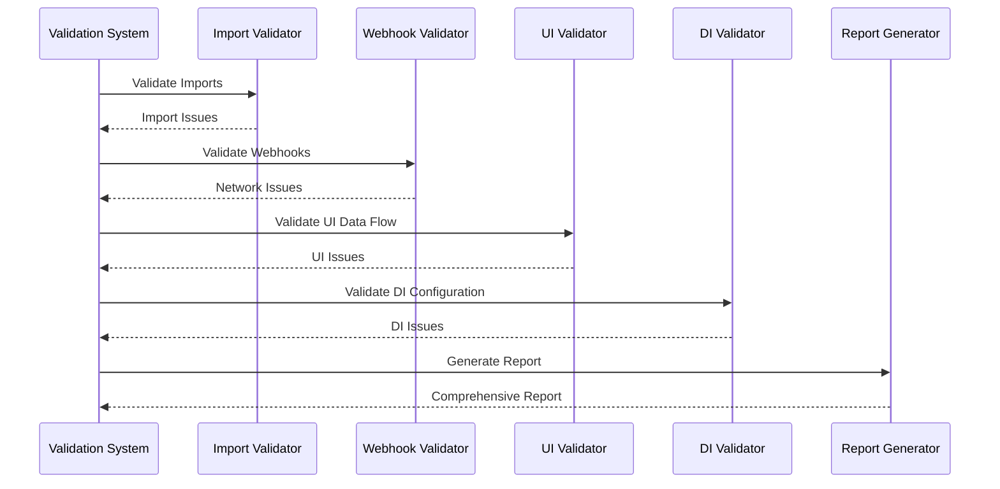

# Design Document

## Overview

Данный документ описывает дизайн системы комплексной проверки кода Android приложения для отслеживания калорий. Система будет анализировать правильность импортов, корректность работы вебхук сервисов Make.com, и правильность отображения данных в UI компонентах. Проверка охватывает все слои Clean Architecture и обеспечивает детальную диагностику потенциальных проблем.

## Architecture

### Validation System Architecture

```mermaid
graph TB
    A[Code Validation System] --> B[Import Validator]
    A --> C[Webhook Service Validator]
    A --> D[UI Data Flow Validator]
    A --> E[DI Configuration Validator]
    A --> F[Architecture Compliance Validator]
    
    B --> B1[Unused Imports Detector]
    B --> B2[Missing Imports Detector]
    B --> B3[Circular Dependencies Detector]
    
    C --> C1[Network Configuration Validator]
    C --> C2[API Endpoint Validator]
    C --> C3[JSON Serialization Validator]
    C --> C4[Error Handling Validator]
    
    D --> D1[ViewModel State Validator]
    D --> D2[Data Binding Validator]
    D --> D3[UI Component Validator]
    D --> D4[Data Mapper Validator]
    
    E --> E1[Hilt Module Validator]
    E --> E2[Dependency Graph Validator]
    E --> E3[Scope Validator]
    
    F --> F1[Layer Dependency Validator]
    F --> F2[Clean Architecture Compliance]
    
    A --> G[Report Generator]
    G --> H[Detailed Analysis Report]
```



### Validation Flow



## Components and Interfaces

### 1. Import Validation Component

#### ImportValidator Interface
```kotlin
interface ImportValidator {
    suspend fun validateImports(projectPath: String): ImportValidationResult
    suspend fun findUnusedImports(filePath: String): List<UnusedImport>
    suspend fun findMissingImports(filePath: String): List<MissingImport>
    suspend fun validateArchitecturalDependencies(filePath: String): List<ArchitecturalViolation>
}

data class ImportValidationResult(
    val unusedImports: List<UnusedImport>,
    val missingImports: List<MissingImport>,
    val architecturalViolations: List<ArchitecturalViolation>,
    val circularDependencies: List<CircularDependency>
)
```

#### Key Validation Rules
- **Unused Imports**: Detect import statements not used in the file
- **Missing Imports**: Identify missing imports causing compilation issues
- **Architectural Violations**: Check for violations of Clean Architecture dependency rules
- **Circular Dependencies**: Detect circular import dependencies

### 2. Webhook Service Validation Component

#### WebhookValidator Interface
```kotlin
interface WebhookValidator {
    suspend fun validateMakeService(): WebhookValidationResult
    suspend fun validateNetworkConfiguration(): NetworkConfigResult
    suspend fun validateApiEndpoints(): ApiEndpointResult
    suspend fun testWebhookConnectivity(): ConnectivityResult
}

data class WebhookValidationResult(
    val networkConfig: NetworkConfigResult,
    val apiEndpoints: ApiEndpointResult,
    val connectivity: ConnectivityResult,
    val jsonSerialization: SerializationResult
)
```

#### Validation Areas
- **Network Configuration**: Validate OkHttp and Retrofit setup
- **API Endpoints**: Check endpoint URLs and HTTP methods
- **JSON Serialization**: Validate request/response data classes
- **Error Handling**: Check safeApiCall implementation
- **Connectivity**: Test actual webhook connectivity

### 3. UI Data Flow Validation Component

#### UIDataFlowValidator Interface
```kotlin
interface UIDataFlowValidator {
    suspend fun validateViewModels(): ViewModelValidationResult
    suspend fun validateDataBinding(): DataBindingResult
    suspend fun validateStateManagement(): StateManagementResult
    suspend fun validateUIComponents(): UIComponentResult
}

data class ViewModelValidationResult(
    val stateFlowIssues: List<StateFlowIssue>,
    val dataBindingIssues: List<DataBindingIssue>,
    val lifecycleIssues: List<LifecycleIssue>
)
```

#### Validation Focus Areas
- **StateFlow/LiveData**: Check proper state management
- **Data Binding**: Validate UI data binding correctness
- **Compose Components**: Check data flow in Compose UI
- **ViewModel Lifecycle**: Validate proper lifecycle handling

### 4. DI Configuration Validation Component

#### DIValidator Interface
```kotlin
interface DIValidator {
    suspend fun validateHiltModules(): HiltValidationResult
    suspend fun validateDependencyGraph(): DependencyGraphResult
    suspend fun validateScopes(): ScopeValidationResult
}

data class HiltValidationResult(
    val moduleIssues: List<ModuleIssue>,
    val bindingIssues: List<BindingIssue>,
    val scopeIssues: List<ScopeIssue>
)
```

#### Validation Areas
- **Module Configuration**: Check Hilt module setup
- **Dependency Bindings**: Validate interface to implementation bindings
- **Scope Management**: Check proper scope usage
- **Circular Dependencies**: Detect DI circular dependencies

## Data Models

### Validation Results

```kotlin
// Base validation result
sealed class ValidationResult {
    data class Success(val message: String) : ValidationResult()
    data class Warning(val message: String, val details: String) : ValidationResult()
    data class Error(val message: String, val details: String, val fix: String?) : ValidationResult()
}

// Import validation models
data class UnusedImport(
    val filePath: String,
    val importStatement: String,
    val lineNumber: Int
)

data class MissingImport(
    val filePath: String,
    val missingClass: String,
    val suggestedImport: String?,
    val lineNumber: Int
)

data class ArchitecturalViolation(
    val filePath: String,
    val violationType: ViolationType,
    val description: String,
    val suggestion: String
)

// Webhook validation models
data class NetworkConfigIssue(
    val component: String,
    val issue: String,
    val severity: Severity,
    val fix: String?
)

data class ApiEndpointIssue(
    val endpoint: String,
    val method: String,
    val issue: String,
    val expectedFormat: String?
)

// UI validation models
data class StateFlowIssue(
    val viewModelClass: String,
    val stateProperty: String,
    val issue: String,
    val recommendation: String
)

data class DataBindingIssue(
    val componentFile: String,
    val bindingProperty: String,
    val issue: String,
    val fix: String?
)
```

### Report Models

```kotlin
data class ValidationReport(
    val timestamp: Long,
    val projectPath: String,
    val summary: ValidationSummary,
    val importValidation: ImportValidationResult,
    val webhookValidation: WebhookValidationResult,
    val uiValidation: UIValidationResult,
    val diValidation: DIValidationResult,
    val recommendations: List<Recommendation>
)

data class ValidationSummary(
    val totalIssues: Int,
    val criticalIssues: Int,
    val warningIssues: Int,
    val infoIssues: Int,
    val overallScore: Int // 0-100
)

data class Recommendation(
    val category: String,
    val priority: Priority,
    val title: String,
    val description: String,
    val actionItems: List<String>
)
```

## Error Handling

### Error Categories

1. **Critical Errors**: Issues that prevent compilation or runtime
2. **Warnings**: Issues that may cause problems but don't break functionality
3. **Suggestions**: Improvements for code quality and maintainability

### Error Recovery

```kotlin
class ValidationErrorHandler {
    fun handleValidationError(error: ValidationError): ValidationResult {
        return when (error.type) {
            ErrorType.COMPILATION_ERROR -> ValidationResult.Error(
                message = error.message,
                details = error.details,
                fix = error.suggestedFix
            )
            ErrorType.RUNTIME_RISK -> ValidationResult.Warning(
                message = error.message,
                details = error.details
            )
            ErrorType.CODE_QUALITY -> ValidationResult.Success(
                message = "Suggestion: ${error.message}"
            )
        }
    }
}
```

## Testing Strategy

### Unit Testing

```kotlin
class ImportValidatorTest {
    @Test
    fun `should detect unused imports`() {
        // Test unused import detection
    }
    
    @Test
    fun `should identify missing imports`() {
        // Test missing import detection
    }
    
    @Test
    fun `should validate architectural dependencies`() {
        // Test Clean Architecture compliance
    }
}

class WebhookValidatorTest {
    @Test
    fun `should validate network configuration`() {
        // Test network setup validation
    }
    
    @Test
    fun `should test webhook connectivity`() {
        // Test actual webhook connection
    }
}
```

### Integration Testing

```kotlin
class ValidationSystemIntegrationTest {
    @Test
    fun `should perform complete project validation`() {
        // Test full validation flow
    }
    
    @Test
    fun `should generate comprehensive report`() {
        // Test report generation
    }
}
```

## Implementation Details

### File Analysis Strategy

1. **Static Analysis**: Parse Kotlin files using KotlinPoet or similar
2. **AST Traversal**: Walk the Abstract Syntax Tree to identify issues
3. **Pattern Matching**: Use regex and pattern matching for specific validations
4. **Compilation Check**: Attempt compilation to catch missing imports

### Webhook Testing Strategy

1. **Configuration Validation**: Check Retrofit and OkHttp setup
2. **Mock Testing**: Test with mock responses
3. **Live Testing**: Optional live webhook testing
4. **Error Simulation**: Test error handling scenarios

### UI Validation Strategy

1. **StateFlow Analysis**: Check StateFlow usage patterns
2. **Compose Analysis**: Validate Compose component data flow
3. **ViewModel Testing**: Test ViewModel state management
4. **Data Binding Validation**: Check UI data binding correctness

### Performance Considerations

- **Parallel Processing**: Run validations in parallel where possible
- **Caching**: Cache analysis results for unchanged files
- **Incremental Analysis**: Only analyze changed files when possible
- **Memory Management**: Efficient memory usage for large projects

## Security Considerations

- **Sensitive Data**: Avoid logging sensitive information
- **Network Security**: Validate HTTPS usage for webhooks
- **API Keys**: Check for hardcoded API keys
- **Data Sanitization**: Ensure proper data sanitization

## Monitoring and Metrics

### Validation Metrics

- **Validation Time**: Time taken for each validation type
- **Issue Detection Rate**: Number of issues found per validation
- **False Positive Rate**: Rate of incorrect issue detection
- **Fix Success Rate**: Rate of successful issue fixes

### Reporting Metrics

- **Report Generation Time**: Time to generate comprehensive report
- **Report Accuracy**: Accuracy of reported issues
- **User Action Rate**: Rate of users acting on recommendations